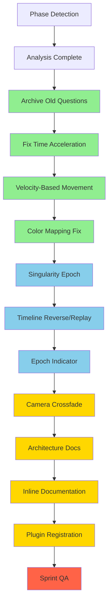

# Orchestrator Session Plan
**Date:** 2026-02-09  
**Phase:** IMPLEMENTATION  
**Sprint:** 1 - Phase 1: The Singularity

---

## Phase Detection Result

**Current Phase: IMPLEMENTATION**

The project infrastructure is in place (workspace, 3 crates, Bevy scaffold), but many Phase 1 features remain incomplete or contradict PRD requirements.

---

## Project State Summary

### Completed Foundation ✓
- Core infrastructure (workspace: genesis-core, genesis-render, genesis-ui)
- Basic particle rendering with custom WGSL shader
- Camera system (free-flight + orbit modes)
- Time integration with f64 accumulator (TimeAccumulator)
- UI overlay (FPS, particle count, epoch info panels)
- Timeline UI (play/pause, logarithmic slider, speed control)
- Configuration system (TOML with CLI override)
- Energy-based color mapping (partial - uses distance instead of velocity)

### Critical Issues Blocking Phase 1 Completion

| Priority | Issue | Location | Current State | PRD Requirement |
|----------|-------|----------|---------------|-----------------|
| CRITICAL | Time acceleration range | `genesis-core/src/config.rs:152` `genesis-ui/src/timeline/mod.rs:170` | 0.1..=10.0 | **1x to 10¹²x** |
| CRITICAL | Particle movement | `genesis-render/src/particle/mod.rs:80` | Constant speed | Use actual velocity field |
| CRITICAL | Timeline reverse/replay | Not implemented | Forward only | Scrubbing back and forth |
| HIGH | Singularity epoch | `genesis-core/src/epoch/singularity.rs:39` | Empty build() method | Register epoch systems |
| HIGH | Color mapping | `genesis-render/src/particle/mod.rs` | Distance-based | Velocity/energy-based |
| MEDIUM | Epoch indicator | Not implemented | Missing | Show era, temp, scale factor |
| MEDIUM | Camera crossfade | Not implemented | Missing | Smooth epoch transitions |

---

## Technical Decisions Made

### 1. Timeline Reverse/Replay Strategy
**Decision: Checkpoint-based rewind**

- Store simulation snapshots at intervals (every 1,000 frames or epoch transition)
- When scrubbing backward, rewind to nearest checkpoint and fast-forward
- Tradeoff: Brief pause when scrubbing, but memory-efficient and feasible

**Rationale:**
- Full state recording is impossible (terabytes of memory for 100K-1M particles)
- Deterministic replay requires full re-simulation (too slow for real-time UX)
- Checkpoint approach balances UX with technical feasibility
- Matches industry standard for timeline systems (video editors, games)

### 2. Time Acceleration Mapping
**Decision: Logarithmic slider with exponential mapping**

- Current slider range: 0.1..=10.0 (WRONG)
- New slider range: 1.0..=12.0 (logarithmic scale, represents 10^x multiplier)
- Display actual acceleration: "10^3x", "10^6x", "10^9x", "10^12x"
- Implementation: `acceleration = 10.0_f64.powf(slider_value)`

**Rationale:**
- PRD specifies 1x to 10¹²x range (12 orders of magnitude)
- Linear slider can't represent this range meaningfully
- Logarithmic mapping is standard for exponential scales
- Allows fine control at low speeds and fast access to high speeds

### 3. Velocity-Based Particle Movement
**Decision: Use particle velocity field instead of constant speed**

- Current: `position += direction * constant_speed * delta_time`
- New: `position += velocity * delta_time`
- Color mapping: Use `velocity.length()` (kinetic energy) instead of `position.length()`

**Rationale:**
- PRD specifies outward velocity with energy-based color mapping
- Current constant speed is a placeholder implementation
- Physics-based movement enables future phase transitions (inflation, gravity)

### 4. Singularity Epoch Systems
**Decision: Add minimal singularity-specific systems**

- Register basic particle spawning for singularity epoch
- Add epoch-specific parameter initialization (temperature ~10^27 K)
- Implement simple outward expansion model

**Rationale:**
- Empty build() method is a placeholder that should be filled
- Even minimal systems enable epoch transition framework
- Can be enhanced in future phases

---

## Action Plan (Prioritized)

### Phase 1: Unblock Development (Immediate)

**Task 1: Archive old communication artifacts**
- Move 9 files from `comms/outbox/` to `comms/archive/`
- Files have been pending >24 hours without user response
- Clean workspace for new work

**Task 2: Fix time acceleration range**
- Update `genesis-core/src/config.rs:152`: `time_acceleration_min: 0.1` → `1.0`
- Update `genesis-ui/src/timeline/mod.rs:170`: Slider range `0.1..=10.0` → `1.0..=12.0`
- Update slider display to show exponential notation ("10^3x", etc.)

**Task 3: Implement velocity-based particle movement**
- Modify `genesis-render/src/particle/mod.rs:80` `update_particles()` system
- Change from constant speed to actual velocity field
- Test with outward expansion visualization

**Task 4: Fix particle color mapping**
- Change `update_particle_energy_colors()` to use velocity instead of distance
- Implement energy-based color gradient: `energy_to_color(velocity.length())`

### Phase 2: Implement Missing Features (High Priority)

**Task 5: Fill singularity epoch build() method**
- Add particle spawning system to SingularityEpoch
- Register epoch-specific parameters
- Test epoch activation

**Task 6: Implement timeline reverse/replay**
- Add snapshot checkpoint system
- Modify timeline scrubber to handle backward movement
- Implement fast-forward from checkpoint

**Task 7: Add epoch indicator display**
- Create UI panel showing current era, temperature, scale factor
- Update based on EpochManager state
- Format numbers with appropriate units (K, Myr, Gyr)

### Phase 3: Enhancements (Medium Priority)

**Task 8: Add camera transition crossfade**
- Implement screen fade effect on epoch transitions
- Use OverlayState or new resource for crossfade control
- Integrate with EpochManager transition events

**Task 9: Update ARCHITECTURE.md**
- Document final crate structure and responsibilities
- Add any new architectural decisions
- Update implementation status

**Task 10: Add inline documentation**
- Document public APIs in genesis-core (TimeAccumulator, CameraMode, EpochCameraConfig, SingularityEpoch, Particle) - **Note: EpochPlugin trait is not implemented (deferred to Phase 2+)**
- Document public APIs in genesis-render (CameraMode/State, InputState, Particle component)
- Document public APIs in genesis-ui (OverlayState, PlaybackState)

### Phase 4: Cleanup & QA

**Task 11: Create and register RenderPlugin and UIPlugin**
- Create `genesis-render::RenderPlugin` aggregating camera, input, particle systems
- Create `genesis-ui::UIPlugin` aggregating timeline, overlay systems
- Update `main.rs` to register both plugins

**Task 12: Sprint QA**
- Run full build: `cargo build --release`
- Run test suite: `cargo test`
- Fix any errors
- Create/update `.sprint_complete` marker

---

## Subtask Decomposition Guidelines

For each task above, I will:

1. **Break into atomic subtasks** (2-5 per parent task)
2. **Specify exact file paths** and function signatures
3. **Provide acceptance criteria** (compilable code, passing tests)
4. **Include context** for subagents (prior work, dependencies)
5. **Verify each subtask** before proceeding to next

---

## Mermaid Diagram: Task Flow

Legend:
- Green: Phase 1 (Immediate - Unblock Development)
- Blue: Phase 2 (High Priority - Missing Features)
- Gold: Phase 3 (Medium Priority - Enhancements)
- Red: Phase 4 (Cleanup & QA)

---

## Session Termination Policy

Per orchestrator protocol:
- **Complete exactly ONE parent task per session**
- After completing a task and marking it in TODO.md, **STOP the session**
- Resume in next session for next task
- This ensures focused, verifiable progress

---

## Next Action

Switch to **orchestrator mode** to begin delegating Task 1 (Archive old communication artifacts) to code-mode subagents.
